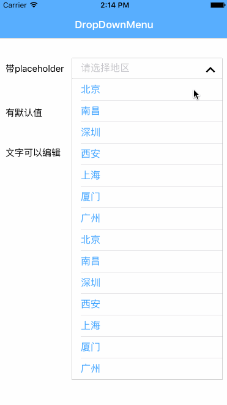

# ZHDropDownMenu

[](https://travis-ci.org/cheng4741@qq.com/ZHDropDownMenu)
[](http://cocoapods.org/pods/ZHDropDownMenu)
[](http://cocoapods.org/pods/ZHDropDownMenu)
[](http://cocoapods.org/pods/ZHDropDownMenu)

## Example

To run the example project, clone the repo, and run `pod install` from the Example directory first.



## Requirements
* Swift 4.0
* iOS 8+

## Useage

1. drag a view into Storyboard, and set its class to `ZHDropDownMenu `


2. set options & other properties

	```           
	menu.options = ["1992","1993","1994","1995","1996","1997","1998"]//设置下拉列表项数据
   menu.defaultValue = "1992" //设置默认值
   menu.editable = false //禁止编辑
   menu.showBorder = false //不显示边框
   menu.delegate = self //设置代理
   ```
   
   
3. Implement the delegate

	```    
	//选择完后回调
    func dropDownMenu(menu: ZHDropDownMenu!, didChoose index: Int) {
        print("\(menu) choosed at index \(index)")
    }
    
    //编辑完成后回调
    func dropDownMenu(menu: ZHDropDownMenu!, didInput text: String!) {
        print("\(menu) input text \(text)")
    }
    ```
 
## Installation

ZHDropDownMenu is available through [CocoaPods](http://cocoapods.org). To install
it, simply add the following line to your Podfile:

```ruby
pod 'ZHDropDownMenu'
```

## Author

cheng4741@qq.com

## License

ZHDropDownMenu is available under the MIT license. See the LICENSE file for more info.
